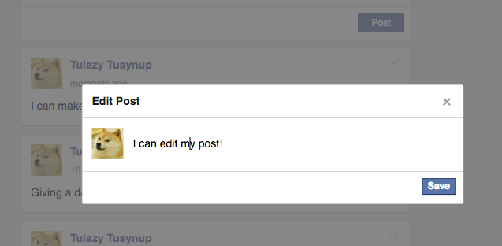
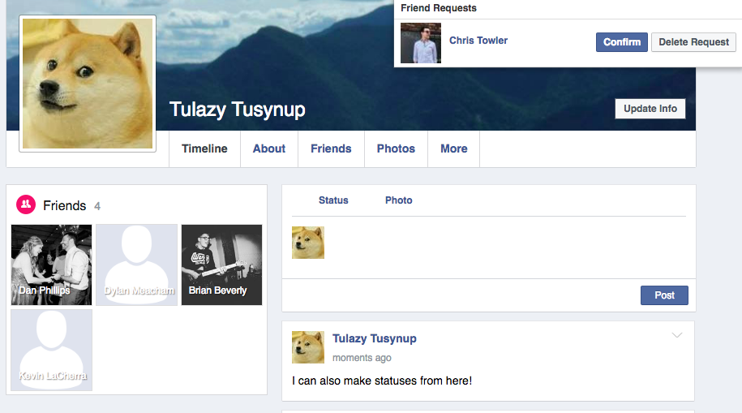

#Fakebook
Fakebook is a web application built with Ruby on Rails, PostgreSQL, and React.js and is modeled on Facebook.com's feel and functionality.

View it live at http://fakebookapp.xyz

###Main Functionality:
* Create/Sign in to user accounts (with fully functional one-click guest sign-in)
* Create/Edit/Delete posts and statuses
* Upload Profile and Cover photos
* Add and remove friends

###Additional Features:
* React.js communicating with a RESTful json API through custom AJAX requests
* Custom authentication via Rails

###Walkthrough

Visiting http://fakebookapp.xyz will take you to the sign-up/sign-in page if you aren't already signed in.

You can either log in at the top with an existing account, create an account using the form, or click the guest sign-in button.

Successful login will take you to your main feed, where you can view statuses and posts in reverse-chronological order.

From here, you can easily use the form to create a new status update.

Your new post will appear without needing to refresh the page!

Clicking the arrow in the top-right corner will open your post options menu.

Clicking the "Edit post" option will open a modal editing window.

To delete the post, you can click the delete option, and it will be removed without needing to refresh.

At the top of the screen, you may notice a notifications bar.

If you have notifications, clicking the button will cause a drop-down to appear!

After confirming or denying any requests, the number on the button will continue to reflect how many requests you have.

Clicking your name on a post you made or on the button on your nav bar will take you to your timeline.

You have access to all the same post features here as well!

In the left column of your timeline, you will see a "Friends" box.

This box will automatically update and resize to include any new friends you may accept.

Hovering over the bottom of your profile photo will reveal the following button:

Clicking this will open a file upload menu, which will allow you to change your profile picture.

The same option is available for your cover photo!

